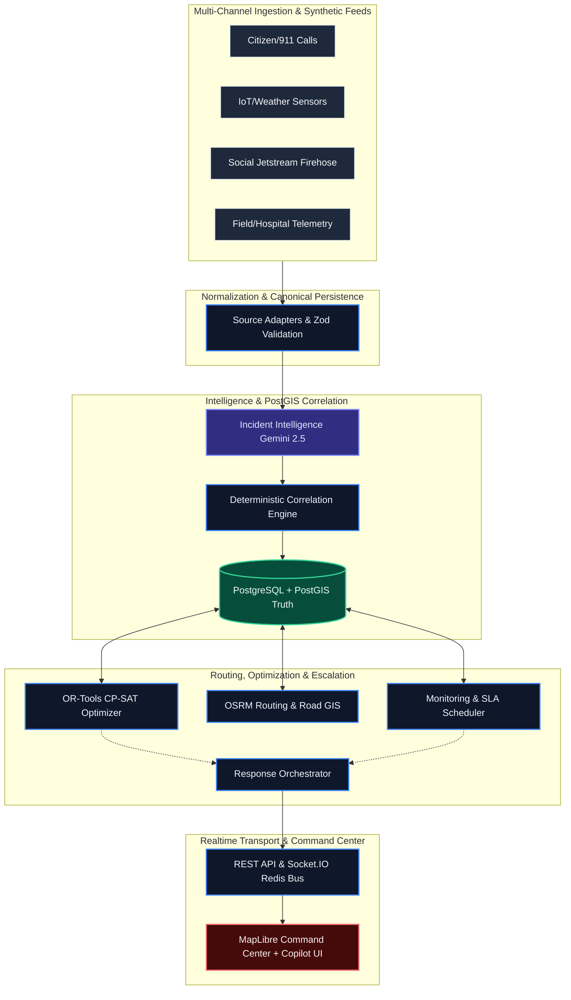
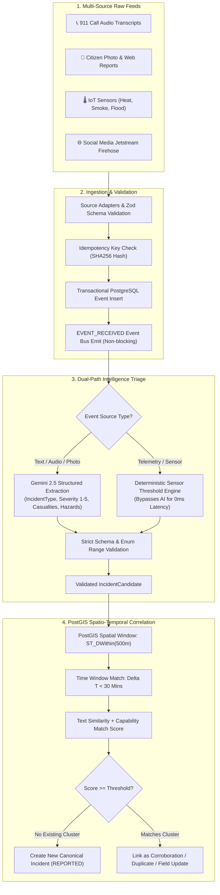
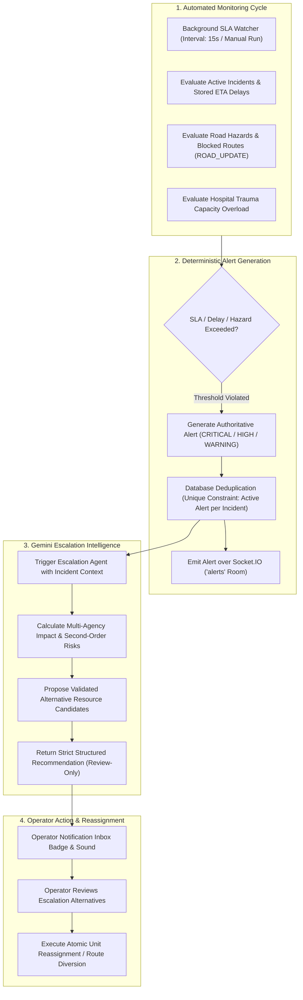

<div align="center">
  
# 🚨 ResQai

**AI-Powered Intelligent Emergency Response & Resource Coordination Platform**

[](#)
[](#)
[](#)
[](#)
[](#)

</div>

<br/>

**ResQai** is an advanced, AI-driven emergency operations platform designed to transform fragmented reports—from citizens, emergency calls, IoT sensors, field teams, and hospitals—into a unified, real-time shared operational picture and coordinated response workflow.

---

## 🎯 Key Features (Core Deliverables)

ResQai directly addresses all requirements for an Intelligent Emergency Response Platform:

- 📡 **Multi-Source Incident Collection:** Ingests emergency data from 911 calls, citizen apps, IoT sensors, and live social media streams.
- 🧠 **AI Incident Classification:** Uses Gemini to automatically classify incident types, estimate severity (1-5), and assign priority levels.
- 🔗 **Smart Duplicate Detection:** PostGIS spatio-temporal clustering identifies duplicate/related reports within a 500m & 30-minute window and consolidates them.
- 🚒 **Resource Recommendation:** OR-Tools CP-SAT optimizer recommends the best emergency teams, vehicles, and facilities based on capability, severity, and travel ETA.
- 🖥️ **Real-Time Monitoring Dashboard:** An interactive MapLibre command center displaying active emergencies, severity, assigned teams, and live response status.
- 🚨 **Alerts & Escalation:** Automated SLA monitoring triggers alerts for critical incidents, delayed responses, and route hazards requiring escalation.
- 🤖 **AI Assistance:** Gemini generates emergency summaries, multi-agency impact analyses, and operational recommendations for response teams.
- 📊 **Analytics & Heatmaps:** Live operational analytics detailing emergency types, response delays, resource shortages, and historical heatmaps of frequently affected areas.
- 🔔 **Real-Time Notifications:** Socket.IO & SSE provide timely updates, inbox badges, and alerts to emergency personnel and authorities.

---

## ✨ The 7 Subsystems of ResQ AI

1. **Canonical Event Pipeline (Ingestion)**: Multi-source adapters ingest 911 audio transcripts, citizen photo reports, IoT sensor thresholds, and social streams. Produces immutable canonical events with deterministic idempotency keys and transactional DB commits.
2. **AI & Spatio-Temporal Correlation Engine**: Gemini parses unstructured text/images into schema-restricted `IncidentCandidate` objects. PostGIS spatio-temporal clustering fuses signals within 500m & 30-minute windows.
3. **Resource Optimizer (OR-Tools)**: CP-SAT constraint optimization sidecar calculates optimal resource allocation matching vehicle capabilities (Fire, Hazmat, EMS, Heavy Rescue) with incident severity, travel times, and hospital beds.
4. **Response Orchestrator**: Executes single & bulk dispatches inside atomic database transactions. Atomic conditional resource claims and partial unique active-assignment indexes strictly prevent double assignments under race conditions.
5. **OSRM Geospatial Routing & Road Hazards**: Computes real road-network turn-by-turn routes, ETA geometry, and integrates real-time road hazard reports (e.g., collapsed bridges, flooded tunnels) to issue route warnings and reassignments.
6. **Realtime Fan-Out & Rooms**: Centralized Socket.IO transport multiplexed into scoped rooms (`operations`, `alerts`, `incident:{id}`). Backed by Redis adapter for horizontal scaling across nodes.
7. **Social Media Firehose Connector**: Consumes live firehose streams (Bluesky Jetstream WSS) via native Node WebSocket, performs high-speed keyword filtering for disasters, and broadcasts verified alerts through REST & Server-Sent Events (SSE).

---

## 🏗️ System Architecture & Engineering Blueprint

ResQai operates on a 5-layer topology and enforces a strict **AI vs. Deterministic Boundary**:

- **✨ Probabilistic AI Domain (Advisory & Interpretation)**: Extracts entities, casualties, and hazards from unstructured media. Synthesizes cross-agency operational summaries, risks, and answers operator queries. *AI CANNOT directly mutate state, assign resources, bypass validation, or execute dispatches.*
- **⚙️ Deterministic Core Domain (Authoritative State)**: Spatio-temporal PostGIS correlation, transactional state machines with atomic DB locks, SLA monitoring engines, and deduplication. PostgreSQL acts as the single source of truth.

### End-to-End 5-Layer Topology



### Flow 1: Signal Ingestion, Dual AI Triage & PostGIS Correlation


### Flow 2: OR-Tools CP-SAT Optimization & Atomic Dispatch Lock

```mermaid
flowchart LR
    subgraph Trigger [1. Dispatch Trigger]
        E1["Operator Opens Incident in Command Center"]
        E2["Required Capabilities Identified\n(FIRE_ENGINE, HEAVY_RESCUE, EMS)"]
    end

    subgraph Optimization [2. CP-SAT Optimization Engine]
        F1["Query Available Units (PostGIS ST_Distance)"]
        F2["Fetch Live Hospital ER/Trauma Capacity"]
        F3{"OR-Tools Sidecar Reachable?"}
        F4["OR-Tools CP-SAT Constraint Solver\n(Min Total Response Time + Max Coverage)"]
        F5["Deterministic Greedy Solver Fallback\n(FALLBACK_GREEDY)"]
        F6["Ranked Candidate Plan + ETA Breakdown"]
    end

    subgraph Orchestration [3. Atomic Response Orchestration]
        G1["Operator Confirms Single / Bulk Dispatch"]
        G2["Begin Database Transaction"]
        G3["Atomic Conditional Resource Claim\n(status = AVAILABLE -> ASSIGNED)"]
        G4["Insert Assignment Record (Partial Unique Index)"]
        G5["Commit Transaction & Update Incident -> DISPATCHED"]
    end

    subgraph RoutingRealtime [4. OSRM & Realtime Fanout]
        H1["OSRM Road-Network Geometry & Turn-by-Turn ETA"]
        H2["Socket.IO Room Broadcast ('operations', 'incident:id')"]
        H3["MapLibre Live Path & Responding Unit Rendered"]
    end

    Trigger --> F1 --> F2 --> F3
    F3 -- "Yes" --> F4 --> F6
    F3 -- "No / Timeout" --> F5 --> F6
    F6 --> G1 --> G2 --> G3 --> G4 --> G5
    G5 --> H1 --> H2 --> H3
```


### Flow 3: Realtime SLA Monitoring & Escalation


### Flow 4: Twitter/Bluesky Social Media Firehose Connector

```mermaid
flowchart LR
    subgraph FirehoseWSS [1. Bluesky Jetstream Relay]
        T1["wss://jetstream2.us-west.bsky.network"]
        T2["app.bsky.feed.post collection stream"]
    end

    subgraph Connector [2. TwitterConnector Engine]
        U1["Native Node WebSocket (Auto-Reconnect)"]
        U2["Filter: kind == 'commit' && op == 'create'"]
        U3["10 Disaster Keywords Matching (Fire, Crash, Earthquake...)"]
        U4["In-Memory Ring Buffer (100 Recent Incidents)"]
        U5["EventEmitter ('incident')"]
    end

    subgraph APIEndpoints [3. Express Routes & SSE]
        V1["GET /api/v1/twitter-connector/status"]
        V2["GET /api/v1/twitter-connector/incidents"]
        V3["GET /api/v1/twitter-connector/stream (SSE)"]
        V4["POST /start | POST /stop"]
    end

    subgraph ResQCore [4. ResQ AI Event Ingestion]
        W1["POST /api/v1/events (Source: SOCIAL_FEED)"]
        W2["Realtime Incident Correlation & Map Alert"]
    end

    FirehoseWSS --> U1 --> U2 --> U3 --> U4 --> U5
    U5 --> APIEndpoints
    APIEndpoints --> W1 --> W2
```


---

## 🔄 Lifecycle State Machines

### 🚨 Incident Operational Lifecycle
- **REPORTED**: Initial candidate or sensor trigger
- **ASSESSING**: Optimizer evaluates required capabilities
- **DISPATCHED**: Resources assigned and confirmed
- **ON_SCENE**: First unit arrives on site
- **RESOLVED / CANCELLED**: Post-incident audit & unit release

### 🚑 Unit Assignment Lifecycle
- **ASSIGNED**: Unit reserved via conditional claim
- **EN_ROUTE**: OSRM dynamic route navigation active
- **ON_SCENE**: On-site mitigation in progress
- **COMPLETED**: Unit restored to `AVAILABLE` status

---

## 💻 Technology Stack

| Domain | Technologies |
|---|---|
| **Frontend** | React, Vite, Tailwind CSS, shadcn/ui, MapLibre GL JS |
| **Backend API** | Node.js, Express, REST, Socket.IO (Optional Redis Fan-out) |
| **Database** | PostgreSQL 16, PostGIS 3.5, Prisma ORM |
| **Artificial Intelligence** | Google Gemini (Structured Output, Bounded Read-only Tools) |
| **Maps & Routing** | OpenStreetMap, OSRM, PostGIS |
| **Optimization Sidecar** | Python, Google OR-Tools (CP-SAT solver) |

---

## 🚀 Quick Start (Local Development)

### Prerequisites
- **Node.js** (v20+)
- **npm** (v10+)
- **Docker Desktop** (Required for the bundled PostgreSQL/PostGIS database)
- **Python 3.x** (Required only for the optional OR-Tools sidecar)

### 1. Setup & Environment
```bash
# Install dependencies
npm install

# Setup environment variables
cp .env.example .env
```
> **Note:** Edit `.env` to add your `GEMINI_API_KEY` to enable AI intelligence. The backend requires `DATABASE_URL`.

### 2. Database Initialization
```bash
# Generate Prisma Client
npm run db:generate

# Start the PostgreSQL/PostGIS container (runs on port 5433)
docker compose up -d postgres

# Apply schema migrations and seed initial validation data
npm run db:deploy
npm run db:seed
```

### 3. Start the Application
To run the full stack (Frontend, Backend, and Optimizer Sidecar):
```bash
# Setup Python virtual environment for the optimizer sidecar (first time only)
python3 -m venv .venv
.venv/bin/pip install -r optimizer/requirements.txt

# Start all services
npm run dev:full
```
*If you skip the python setup, you can simply run `npm run dev`. The system will gracefully fall back to a deterministic greedy planner.*

**Access the application:**
- 🖥️ **Command Center (UI)**: [http://localhost:5173](http://localhost:5173)
- ⚙️ **Backend API**: `http://localhost:4000/api/v1`

---

## 🎮 Demo Walkthrough

Want to see the engine in action? ResQai includes a fully deterministic **Synthetic Emergency World**.

1. **Launch the Command Center**: Open `http://localhost:5173`.
2. **Start a Scenario**: In the **Demo Console** (bottom right/header), select a scenario like `INDUSTRIAL_FIRE` or `EARTHQUAKE`, set the simulation speed (e.g., `20×`), and press **Start**.
3. **Observe Ingestion**: The system will begin emitting temperature, smoke, citizen calls, and field observations through the standard ingestion API.
4. **Watch Correlation**: See fragmented observations automatically merge into consolidated `Incidents` on the operations queue and live map.
5. **Orchestrate Response**: Click on a new incident, open **Begin Assessment**, review the AI analysis, and utilize the **OR-Tools Optimizer** to automatically recommend the optimal deployment of fire, medical, and rescue units.
6. **Command & Control**: Advance assignments through their lifecycle (En-Route, On-Scene), monitor incoming alerts, and view live analytics.

---

## 🏗️ Development & Contribution Guidelines

- **Database is Truth**: Realtime WebSocket messages (Socket.IO) are used strictly for UI notifications, not as a replacement for persisted state. 
- **AI Boundaries**: AI components (Gemini) are strictly for interpretation, structuring unstructured data, and read-only situation analysis. **AI cannot mutate state, assign resources, or overwrite database tables directly.**
- **Codebase**: We use standard JavaScript (`.js`/`.jsx`) across the stack. Keep domain logic inside the modular monolith boundaries (e.g. `frontend/`, `backend/`, `optimizer/`).
- **Geospatial Processing**: Heavy geospatial queries (`ST_DWithin`, `ST_Distance`) must happen inside the PostGIS database via Prisma `$queryRaw`, not inside Node memory.

### Useful Commands
```bash
npm run dev         # Start Frontend + Backend (without Python optimizer)
npm run lint        # Run ESLint
npm run build       # Build Frontend
npm run db:migrate  # Create a new Prisma migration
npm run db:studio   # Open Prisma Database UI
```

---

*For an exhaustive breakdown of the API contracts, database schema, and architectural decisions, please refer to the [ARCHITECTURE.md](docs/ARCHITECTURE.md).*
