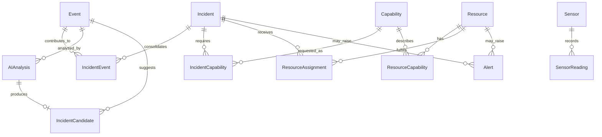

# ResQai Architecture

**Status legend:** **IMPLEMENTED** exists and is runnable now. **PLANNED** is committed near-term design. **FUTURE** is an extension point, not a current capability.

This document is the authoritative architecture reference for future ResQai prompts. If code and this document diverge, the same change must reconcile them.

## 1. Product overview

ResQai converts fragmented emergency signals into canonical incidents, assesses and correlates them, recommends resources, monitors response progress, escalates delays, and exposes the operational state to command-center and field interfaces.

**IMPLEMENTED:** live command center, versioned database-backed APIs, PostgreSQL/PostGIS operational store, Prisma repository layer, response orchestration, and hardened Socket.IO operational event delivery.

**IMPLEMENTED:** the operational workflow through monitoring, alerts, recommendation-only escalation, realtime delivery, and map-centered command presentation.

## 2. Goals

- Deliver an end-to-end, reliable, explainable hackathon system quickly.
- Provide one coherent operational picture across incidents, resources, hospitals, assignments, alerts, and routes.
- Make maps and realtime updates primary interaction surfaces.
- Separate probabilistic interpretation from deterministic decisions and state transitions.
- Preserve modular boundaries that could be extracted later without premature microservices.

## 3. Non-goals

- Independent microservices for every domain.
- Kafka, RabbitMQ, or a heavyweight multi-agent framework.
- AI-controlled resource assignment or authoritative state mutation without deterministic validation.
- Production authentication, warehouse-scale analytics, validated training simulation, or certified dispatch operations.

## 4. Architecture diagram

```text
                  SYNTHETIC EMERGENCY WORLD [IMPLEMENTED]
                            │
             ┌──────────────┼──────────────┐
          Citizens       Sensors       Field Teams
          Calls/Feeds     Weather       Hospitals
             └──────────────┼──────────────┘
                            ▼
                    EVENT INGESTION
                            ▼
                   EVENT NORMALIZATION
                            ▼
              INCIDENT INTELLIGENCE (AI)
                            ▼
              CORRELATION / DEDUPLICATION
                            ▼
         POSTGRESQL + POSTGIS OPERATIONAL TRUTH
                            │
           ┌────────────────┼────────────────┐
           ▼                ▼                ▼
       SITUATION         RESOURCE         MONITORING
       ANALYST AI       OPTIMIZER          ENGINE
           └────────────────┼────────────────┘
                            ▼
                  RESPONSE ORCHESTRATOR
                            │
                    REST + SOCKET.IO
                            │
                 ┌──────────┴──────────┐
                 ▼                     ▼
          COMMAND CENTER         FIELD RESPONDER
                 │
                 ▼
              MAP / GIS
```

The database is the central source of operational truth. Socket.IO, queues, caches, and AI outputs are derived communication or processing mechanisms and do not supersede persisted state.

## 5. Frontend architecture

**IMPLEMENTED:** React/Vite command center, Tailwind CSS pipeline, environment contract, and one Socket.IO singleton exposed through `RealtimeProvider`/`useRealtime`. The page is the root landing screen and remains compatible with the `/command-center` history fallback. It contains the operational header, five live KPIs, filterable/sortable incident queue, dominant MapLibre map, entity drawer, resource readiness, active alerts, and hospital capacity.

`CommandCenterProvider` owns normalized dictionaries for incidents, resources, hospitals, alerts, assignments, roads, situation analyses, and presentation-only notifications plus selected entity and map-filter/highlight state. It loads `GET /incidents`, `/resources`, `/hospitals`, `/alerts`, and `/geo/roads` concurrently. Selecting an incident or resource loads only that entity's assignment history, which contains the normalized stored route contract. Components consume the shared context rather than owning duplicate server snapshots.

**IMPLEMENTED:** the incident drawer is an operations workspace. Selection loads `GET /incidents/:id`, `/events`, `/assignments`, and `POST /optimization/recommend`. It presents source observations through a controlled short-content projection, concise incident-intelligence type/confidence/evidence factors, candidate resource scores and reasons, capability coverage, assignment timelines, ETA comparisons, active alerts, and valid incident actions.

Operator actions call the existing deterministic service boundaries: single/bulk assignment, assignment status/cancel/reassign, alert acknowledge/resolve, incident resolve, and orchestrated incident cancellation. Native confirmations protect consequential actions. The store waits for successful responses, merges confirmed entities, and then accepts the same realtime updates as every other client; it does not optimistically invent operational state. Central provider actions are the preparation boundary for later role checks.

The resource directory uses the existing resource snapshot, augmented with a compact public current-incident/active-assignment ETA projection. It supports ID/name, type, status, and capability filtering. Alerts have active/history views and severity/type/status filters. Escalation recommendations remain review-only because Gemini has no mutation authority.

**IMPLEMENTED:** incident detail reads cached Situation Analyst state without triggering Gemini and provides an explicit generate/refresh action. The compact Command Copilot drawer sends only user-triggered questions and executes only validated visualization commands. Map actions can focus an incident/resource/hospital, highlight bounded entity sets, or select an incident route; no AI output is evaluated as code.

**IMPLEMENTED:** the notification center derives presentation records from active alerts and selected high-value realtime events. Read IDs are browser-local, click navigation uses normal provider selection, and browser alerts require explicit permission and are restricted to high/critical messages. Alerts remain the authoritative operational lifecycle; notifications are not a second alert model.

**IMPLEMENTED:** native path selection adds `/analytics` and `/report` without another routing dependency. Analytics data comes from one backend aggregate, Recharts renders operational charts, and a MapLibre GeoJSON heatmap reuses the existing map/style stack. The citizen report form submits multipart evidence, supports optional explicit browser geolocation/manual coordinates, and polls a narrow status projection until processing finishes or an incident is linked.

After the REST snapshot, the store subscribes to `operations`, `alerts`, and the selected entity room. Incident, resource, assignment, alert, and hospital events merge incrementally by public ID; `resource.location_updated` directly changes the resource GeoJSON point. A reconnect preserves the displayed snapshot, restores rooms, then reloads REST once through `reconnectVersion` because realtime has no replay log.

**IMPLEMENTED:** the compact Command Center demo console owns scenario/speed selection plus start, pause, resume, step, stop, monitoring, and scoped reset actions. It follows lifecycle notifications and reconciles the operational REST snapshot after emitted events and reconnects.

**PLANNED:** Field Responder and authentication/route guards.

## 6. Backend architecture

**IMPLEMENTED:** an Express modular monolith with validated environment configuration, Helmet, scoped CORS, bounded JSON parsing, request IDs, structured/redacted logging, versioned routing, centralized 404/error responses, database-backed controllers, and graceful HTTP/Socket.IO/Prisma shutdown.

**IMPLEMENTED:** service modules for event ingestion, simulation, Incident Intelligence, deterministic correlation, incident state, geospatial discovery, routing/ETA, resource intelligence, optimization recommendations, response orchestration, assignment lifecycle, resource location, monitoring, alert lifecycle, escalation recommendations, and realtime publication. Route handlers remain thin: validate input, call application services, and map results/errors to HTTP. Services own use cases; repositories own persistence.

## 7. AI architecture

**IMPLEMENTED:** Incident Intelligence uses Gemini through a replaceable REST client. The provider model is explicitly configured with `GEMINI_MODEL`; credentials come only from `GEMINI_API_KEY`. `GEMINI_TIMEOUT_MS` bounds each request. The client requests structured JSON, retries only transient network/408/429/5xx failures up to two times with backoff, and converts provider, timeout, rate-limit, empty, malformed-JSON, and configuration failures into safe internal error codes.

- **Incident Intelligence Agent — IMPLEMENTED:** turns citizen text, emergency-call transcripts, field reports, and optional validated citizen imagery into a strictly validated candidate containing incident type, title, summary, severity, deterministic priority, confidence, casualty estimates, hazards, supported capabilities, location confidence, and concise evidence. Structured sensor readings use deterministic threshold interpretation for fire, flood, seismic/structural, and traffic signals instead of spending an AI request.
- **Situation Analyst Agent — IMPLEMENTED:** considers one incident plus live source events, assignments/ETA, resource state, alerts/escalation, nearby resources, hospital capacity, and shortages. It returns strict concise risks, gaps, considerations, and controlled review actions. It cannot assign resources.
- **Escalation Agent — IMPLEMENTED:** analyzes only deterministically triggered alerts and recommends whether, why, how urgently, and with which validated alternatives to escalate. It returns strict JSON and cannot execute actions. Any later assignment still passes through the response orchestrator.
- **Command Copilot Agent — IMPLEMENTED:** answers explicit operator questions through bounded read tools for active incidents, incident details/history, available resources/assignments, hospital capacity, delays, shortages, and nearby entities. Its references and visualization action IDs are checked against retrieved tool data.

Event normalization, correlation, geospatial queries, optimization, monitoring, state transitions, and persistence are not LLM agents. AI interprets, reasons, and recommends; deterministic software validates, calculates, optimizes, and executes.

### Incident Intelligence flow and authority boundary

```text
Canonical Event (already persisted)
       │
       ▼
EVENT_RECEIVED
       │ detached in-process subscriber
       ▼
Source-aware processing
   ├── text/call/field → Gemini structured output
   ├── sensor → deterministic threshold rules
   └── unrelated event → auditable SKIPPED result
       │
       ▼
Deterministic schema + enum + range + capability validation
       │
       ▼
AIAnalysis + IncidentCandidate
```

An `IncidentCandidate` is evidence-derived, non-authoritative input to the deterministic correlation engine. It is not itself an `Incident` and cannot assign resources, dispatch, or alter routes. Correlation decides whether it creates a new incident or contributes to an existing incident as a duplicate, corroborating signal, field update, or supporting signal.

The candidate contract uses the existing `IncidentType` and `IncidentPriority` taxonomies. Severity must be an integer from 1–5; confidence and location confidence are 0–1; casualty counts are non-negative integers or null; coordinates must be WGS84; evidence is concise; capabilities are limited to seeded application codes. Gemini's priority value must be syntactically valid, then the backend derives final candidate priority from severity (`5→P0`, `4→P1`, `3→P2`, `1–2→P3`). When the canonical event has a location, it overrides any model-proposed location.

The controlled system prompt requires analysis only from supplied evidence, null for unknown facts, concise auditable evidence rather than chain-of-thought, and prohibits dispatch, assignment, routing, persistence decisions, optimization, or notification actions. Full transcripts, raw model payloads, and API keys are not written to INFO logs.

`AIAnalysis` stores provider, configured model, status, validated structured result, confidence, evidence, bounded attempt count, safe failure code/message, and timestamps. `IncidentCandidate` stores the validated candidate and its correlation outcome separately. Neither table stores hidden reasoning. Invalid output never creates a candidate. AI failures mark the analysis and event processing state failed but cannot roll back the already-persisted event.

The `EVENT_RECEIVED` listener schedules work with `setImmediate` and returns immediately, so event ingestion does not wait for Gemini. This remains process-local and non-durable; a future queue/outbox can replace the subscriber without changing the analysis contract. Incident Intelligence itself has no manual public endpoint; the Situation Analyst and Copilot endpoints are advisory/read-only and must sit behind the future operator-authentication boundary before production use.

### Operational AI tool and grounding boundary

`operationalAITools` is the shared read-only facade for Situation Analyst and Command Copilot. It wraps existing repositories/domain/geo/alert services and exposes active incidents, incident detail/events, available/nearby resources, assignments, hospitals/nearby hospitals, active/incident alerts, delayed incidents, shortage alerts, nearby incidents for a hospital, and a compact current summary. AI services do not query Prisma and cannot import the response orchestrator or alert mutation methods.

Situation analysis uses an in-process cache. A source-state timestamp is the maximum relevant incident/event/assignment/alert/resource/hospital update time. `GET /incidents/:id/analysis` returns cache state without invoking Gemini; `POST` reuses a fresh entry unless explicitly forced. Frontend realtime changes never trigger an AI call. Cache loss on restart is acceptable for the current hackathon deployment.

Copilot retrieval deterministically selects a minimal tool subset from the operator question before Gemini sees data. Recent conversation is capped at six messages; session count is capped at fifty. The provider returns strict structured JSON, then deterministic validation removes references/actions whose IDs were not in the tool results. Allowed map actions are `FOCUS_INCIDENT`, `FOCUS_RESOURCE`, `FOCUS_HOSPITAL`, `SHOW_INCIDENTS`, `SHOW_RESOURCES`, and `SHOW_ROUTE`.

Both capabilities use only supplied tool evidence, use null/empty output for absent facts, preserve uncertainty, prohibit invented entity IDs/capacity/casualties, prohibit operational mutation, and omit hidden reasoning. Gemini configuration/provider/schema failures return advisory-unavailable results while incidents, assignments, monitoring, alerts, realtime, and the map remain active.

## 8. Event architecture

**IMPLEMENTED:** every inbound source uses one deterministic pipeline:

```text
External Sources
      │
      ▼
Source Adapters
      │
      ▼
Source Validation
      │
      ▼
Deterministic Normalization
      │
      ▼
Canonical Validation
      │
      ▼
Event Ingestion Service
      │
      ▼
PostgreSQL
      │
      ▼
EVENT_RECEIVED (internal, in-process)
```

An **event** is an immutable observation or signal. An **incident** is a consolidated operational emergency inferred and correlated from one or more events. Event type and incident type are intentionally separate; ingestion never creates or classifies an incident.

### Canonical event contract

```json
{
  "eventId": "EV-000001",
  "source": "CITIZEN",
  "eventType": "EMERGENCY_REPORT",
  "timestamp": "2026-09-19T10:30:00.000Z",
  "receivedAt": "2026-09-19T10:30:02.125Z",
  "location": { "lat": 23.0225, "lng": 72.5714, "accuracyMeters": 15 },
  "payload": { "text": "Fire near warehouse" },
  "metadata": {
    "sourceId": "citizen-device-123",
    "correlationId": "REQ-123",
    "schemaVersion": "1.0"
  }
}
```

Clients provide `source`, `eventType`, and an object `payload`. They may provide `eventId`, timestamp, location, and metadata. Missing IDs become `EV-<UUID>`. Missing source timestamps fall back to server receive time and set `metadata.timestampFallback = "receivedAt"`. `receivedAt`, schema version, processing state, and persistence timestamps are server-owned.

Sources are `CITIZEN`, `EMERGENCY_CALL`, `SENSOR`, `FIELD_TEAM`, `HOSPITAL`, `GOVERNMENT`, `WEATHER`, `SIMULATOR`, and `SYSTEM`. Event types are `EMERGENCY_REPORT`, `EMERGENCY_CALL`, `SENSOR_READING`, `FIELD_UPDATE`, `RESOURCE_UPDATE`, `HOSPITAL_UPDATE`, `WEATHER_UPDATE`, `ROAD_UPDATE`, and `SYSTEM_ALERT`.

Citizen emergency reports require text; sensor readings require a non-empty object; field updates require resource ID and status. All adapters then use the same canonical validator. Location accepts `lat/lng`, `latitude/longitude`, or GeoJSON Point coordinates and validates WGS84 ranges. Timestamps accept valid ISO-compatible values and reject values more than five minutes in the future. Raw payload fields are preserved without being copied into logs.

### Identity, consistency, and delivery

`eventId` is globally unique. Ingestion checks for an existing row for a fast idempotent response, while the database unique constraint is the concurrency-safe final guard. First persistence returns `201`; repeat submission returns the existing event with `200` and `duplicate: true`. Invalid events never write a row.

Persistence always precedes internal publication. `EVENT_RECEIVED` contains only event identity/type metadata, not raw payload. The internal event bus is process-local, at-most-once, and non-durable: listener failures are logged and do not roll back or falsely reject the stored event. A future queue/outbox may strengthen delivery without changing the ingestion contract.

Internal domain events are backend coordination messages; Socket.IO events are client-facing realtime messages. Raw ingestion does not broadcast to browsers.

## Synthetic Emergency World

**IMPLEMENTED:** ResQai includes a deterministic digital-twin-style emergency simulator. It creates a fictional coordinate space with industrial, residential, commercial, medical, transport, and river-basin zones; roads with capacity and status; risk zones; and read-only snapshots of the existing seeded resources and hospitals. The geography is synthetic and must not be presented as a named real city.

```text
Scenario
   │
   ├── Hidden Ground Truth
   │
   └── Declarative Timeline
          │
          ▼
    Source Generators
          │
          ▼
    Canonical Events
          │
          ▼
   Event Ingestion Service
          │
          ▼
      PostgreSQL
```

The registry provides `INDUSTRIAL_FIRE`, `FLOOD`, `ROAD_ACCIDENT`, and `EARTHQUAKE`. Each scenario defines its description, duration, initial state, hidden incident truth, and causally ordered observations. Earthquake contains three distinct damage incidents; every scenario contains multiple reports about the same incident. This gives later correlation logic both positive and negative examples without performing correlation inside the simulator.

Seeded PRNG instances make ground truth, timelines, wording choices, uncertainty, location accuracy, and victim estimates reproducible for the same scenario and seed. No simulator component uses uncontrolled `Math.random()`. Citizen and call observations intentionally contain plausible uncertainty; sensor observations evolve with scenario phase; field, hospital, weather, and government road updates occur only where causally justified.

`SimulationClock` separates simulated time from wall-clock time and supports 1x, 5x, 10x, and 20x execution plus start, pause, resume, stop, and step behavior. One interval drives each running simulation. `EventScheduler` maintains a sorted timeline cursor, executes due entries once, and cancels pending work on stop; it does not allocate a timer per event. Explicit persisted state transitions prevent duplicate start/resume loops.

`simulation_runs` stores public lifecycle metadata, configuration, a world snapshot, scheduler progress, counters, and failure details. `simulation_ground_truth_incidents` stores hidden evaluation truth behind a simulation-only repository method. Ordinary simulation responses deliberately project only run ID, scenario, status, seed, clock, counts, and lifecycle timestamps. Incident, event, resource, and hospital endpoints never join or query hidden truth.

The ground-truth boundary is strict:

```text
Ground truth → simulator logic and internal evaluation only
Observations → normal event ingestion → operational event store
```

Generators act as external sources (`CITIZEN`, `EMERGENCY_CALL`, `SENSOR`, `FIELD_TEAM`, `HOSPITAL`, `WEATHER`, and `GOVERNMENT`). They call the shared `eventIngestionService`, so source adapters, canonical normalization, validation, idempotency, PostgreSQL persistence, and `EVENT_RECEIVED` remain authoritative. The simulator never writes directly to `events`, never creates inferred incidents, and never mutates operational resource, hospital, road, or assignment state. Such changes remain observations for future orchestration and routing consumers.

Control endpoints are:

- `POST /api/v1/simulations`
- `GET /api/v1/simulations`
- `GET /api/v1/simulations/:runId`
- `POST /api/v1/simulations/:runId/start`
- `POST /api/v1/simulations/:runId/pause`
- `POST /api/v1/simulations/:runId/resume`
- `POST /api/v1/simulations/:runId/stop`
- `POST /api/v1/simulations/:runId/step`
- `POST /api/v1/simulations/:runId/reset`

Reset first stops local scheduling and waits for the active ingestion tick. It refuses destructive cleanup while event intelligence remains in flight or if any incident mixes demo and non-demo evidence. Once safe, one database transaction deletes run-owned evidence and incidents composed only of that evidence, clears their assignments/alerts and entity audit records, restores involved resource state from the captured world snapshot, and rewinds the run.

Invalid scenarios/time scales return 400, missing runs return 404, and invalid lifecycle transitions return 409. The failure policy is fail-fast: a failed ingestion is logged, persisted with safe event context, transitions the run to `FAILED`, and cancels its scheduler. Normal INFO logs contain lifecycle and generated-event metadata but never hidden truth or raw payloads.

The simulator-scoped evaluation route retrieves truth through the simulation repository and compares inferred incident type, severity, location, capabilities, consolidation, and detection latency. Raw truth remains absent from every ordinary route; only structured synthetic metrics and match summaries leave the evaluation boundary. Simulator lifecycle and generated-event notifications remain compact operational projections, never hidden truth.

### Observability and metrics readiness

Completion logs include event ID, source, event type, processing status, duration, and result—never full payload. An in-process metrics-ready counter tracks received, created, duplicate, rejected, failed, and total latency values. It is not a durable metrics system.

## 9. Database architecture

**IMPLEMENTED:** PostgreSQL 16 with PostGIS 3.5 is the operational source of truth. Prisma 6 manages the schema, migrations, typed CRUD, relations, and transactions. The backend owns one hot-reload-safe Prisma client and connects before accepting HTTP traffic; shutdown closes Socket.IO and the database client.

### Schema overview



- `Event` preserves unique external `eventId`, original JSON payload, source, source event type, timestamps, processing state/error, and optional position. Domain code treats raw events as immutable; repositories expose no payload update operation.
- `AIAnalysis` is the provider/audit envelope for Incident Intelligence. `IncidentCandidate` is validated but non-authoritative and awaits correlation.
- `Incident` is the consolidated emergency with constrained type, integer severity 1–5, priority, lifecycle-ready status, confidence, casualty estimates, hazards, location, and resolution timestamps.
- `IncidentEvent` is the explicit many-to-many correlation edge with relationship type, confidence, and timestamps.
- `Capability`, `ResourceCapability`, and `IncidentCapability` normalize capability matching for indexed filtering and future optimization. Capability codes are data, not application branches.
- `Resource` is a unified model for vehicles, teams, aircraft, equipment, and specialist units. `ResourceAssignment` stores every assignment as a separate historical record; assignments are never overwritten to represent reassignment.
- `Hospital` stores operational state and bounded bed, ICU, emergency, and ambulance capacity.
- `Sensor` and indexed `SensorReading` support heterogeneous sensors and time-ordered high-volume readings without adding TimescaleDB.
- `Alert` supports incident/resource links, acknowledgement/resolution lifecycle, and a deterministic monitoring deduplication key. `AuditLog` is append-oriented and stores actor/action/entity plus previous/new JSON state for reconstruction.

### Spatial strategy

Events, incidents, resources, hospitals, and sensors store validated WGS84 latitude/longitude plus a PostGIS `geography(Point, 4326)` value. Numeric coordinates keep standard Prisma reads simple; the geography column is authoritative for distance/radius operations. Every geography column has a GiST index. Repositories write both representations transactionally.

Prisma represents geography as `Unsupported("geography(Point, 4326)")`. Standard CRUD stays in Prisma, while `geoRepository` owns parameterized tagged-template SQL for `ST_DWithin` and `ST_Distance`. Future `ST_Within`, `ST_Intersects`, geofencing, and clustering queries belong in that repository/service boundary—never controllers.

### Repository and transaction boundary

Domain-specific repositories cover events, incidents, resources, assignments, hospitals, sensors/readings, alerts, audits, and geospatial reads. They expose named operations and contain no HTTP or AI concerns. Repository factories accept a Prisma transaction client, and the managed database service exposes `withTransaction(operation)` for future multi-record workflows.

**IMPLEMENTED:** assignment orchestration calculates routing before opening a transaction, then reloads the incident and atomically claims resources with a conditional update requiring `AVAILABLE` and no current incident. The same transaction creates assignment history, updates incident/resource state, and appends audit records. Bulk assignment is all-or-nothing. Route work stays outside the transaction to avoid holding locks across an external OSRM call; authoritative state is revalidated inside it.

Double assignment has two defenses. The conditional PostgreSQL update means only one concurrent transaction can change a resource from available to assigned. A partial unique index on `resource_assignments(resource_id)` for `ASSIGNED`, `ACCEPTED`, `EN_ROUTE`, and `ON_SCENE` is the final database invariant. A losing request returns `409 RESOURCE_NOT_AVAILABLE` and writes no partial assignment.

### Constraints and indexes

PostgreSQL enums constrain state/type fields. Foreign keys define deletion behavior. Check constraints protect coordinate ranges, severity/confidence, non-negative incident counts and travel metrics, capability quantity/proficiency, hospital capacity bounds, and lifecycle timestamps. Unique indexes protect all public identifiers.

B-tree indexes cover event source/type/time/status; incident state/priority/severity/type/timestamps; resource type/status; assignment incident/resource/status combinations; hospital/sensor status; alert status/type/time/incident/deduplication key; audit entity/actor/time; and sensor readings by `(sensor_id, timestamp DESC)` plus global timestamp. Partial unique indexes protect active resource exclusivity and one active/acknowledged alert per monitoring condition. GiST indexes cover all geography columns.

### Migrations, seed, and local runtime

`prisma/migrations/20260919113000_database_foundation/migration.sql` creates PostGIS, core enums, tables, relations, constraints, and indexes. `20260919120000_event_contract` adds the controlled event-type enum, event metadata, and location accuracy. `20260919160000_response_orchestration` adds controlled assignment origin, an operational role, and the partial unique active-resource index. `20260919170000_monitoring_alert_dedup` adds alert deduplication keys and the partial unique active-alert index. `db:migrate` creates development migrations; `db:deploy` applies checked-in migrations; `db:generate` regenerates the client; and `db:studio` opens the data browser.

Docker Compose provides an isolated database on port 5433. Its initialization creates the application database from `template0`, avoiding optional extension drift. The deterministic idempotent seed creates 9 capabilities, 12 resources, 6 hospitals, 12 sensors/readings, and a small linked event/incident/alert/audit baseline. It is verification data, not the future simulator.

Only `DATABASE_URL` is configured today because local and current deployment flows connect directly to PostgreSQL. `DIRECT_DATABASE_URL` will be introduced only if a future hosted environment puts a connection pooler in front of Prisma migrations.

### Scaling and limitations

Prisma cannot manipulate the geography field through normal generated model inputs, and database check constraints remain migration SQL rather than Prisma-schema declarations. These are deliberate, documented SQL exceptions. Raw queries must use Prisma parameter binding; interpolated SQL strings are prohibited.

Future scale work may add sensor-reading partitioning, read replicas for analytics, archival/retention policies, and targeted partial indexes based on observed query plans. Redis remains non-authoritative. No second primary database, event sourcing, CQRS, or premature partitioning is introduced.

## 10. Realtime architecture

**IMPLEMENTED:** Socket.IO server setup, scoped CORS, structured lifecycle logs, validated room subscriptions, one centralized realtime service, and an explicit internal-domain-event bridge. Domain services publish once after commit; the bridge is the only normal route to Socket.IO, preventing duplicate direct emissions.

The client event taxonomy is `incident.created|updated|state_changed|resolved|escalated`, `resource.updated|location_updated|assigned|released`, `assignment.created|updated|cancelled`, `alert.created|updated|resolved`, `hospital.updated`, `simulation.started|paused|resumed|stopped|completed|event`, and `system.notification`. Domain-to-client mapping is declared in `realtime-bridge.js`, rather than inferred across producers.

| Internal domain event | Client event |
|---|---|
| `INCIDENT_CREATED`, `INCIDENT_UPDATED`, `INCIDENT_STATE_CHANGED`, `INCIDENT_RESOLVED`, `INCIDENT_ESCALATED` | matching `incident.*` event; a state change to resolved becomes `incident.resolved` |
| `RESOURCE_UPDATED`, `RESOURCE_LOCATION_UPDATED`, `RESOURCE_ASSIGNED`, `RESOURCE_RELEASED` | matching `resource.*` event |
| `ASSIGNMENT_CREATED`, `ASSIGNMENT_STATUS_CHANGED` | `assignment.created`, `assignment.updated`, or `assignment.cancelled` |
| `ALERT_CREATED`, `ALERT_UPDATED`, `ALERT_RESOLVED` | matching `alert.*` event |
| `HOSPITAL_UPDATED` | `hospital.updated` |
| `SIMULATION_STARTED`, `SIMULATION_PAUSED`, `SIMULATION_RESUMED`, `SIMULATION_STOPPED`, `SIMULATION_COMPLETED`, `SIMULATION_EVENT` | matching `simulation.*` event |
| `SYSTEM_NOTIFICATION` | `system.notification` |

The internal application event bus remains deliberately separate from client-facing Socket.IO. Realtime events use this envelope:

```json
{
  "event": "incident.updated",
  "timestamp": "2026-09-19T00:00:00.000Z",
  "entityType": "INCIDENT",
  "entityId": "INC-123",
  "data": {},
  "version": 1,
  "sequence": 42,
  "metadata": {
    "source": "domain-event-bus",
    "instanceId": "uuid",
    "correlationId": "REQ-123"
  }
}
```

`eventId` and `aggregateId` are retained as compatibility aliases. The monotonic `sequence` is process-local, not durable or globally ordered across replicas. Clients treat messages as notifications of committed state, load initial state through REST, and fully reconcile through REST after reconnect because there is no replay log.

Rooms are `operations`, `alerts`, `incident:<id>`, `resource:<id>`, and `simulation:<id>`. Clients use acknowledged `subscribe`/`unsubscribe` commands; arbitrary room names are rejected. Connections receive non-authoritative metadata (`connectedAt` and a neutral identity placeholder) so later authentication can enforce room access without changing the transport contract. `GET /api/v1/realtime/status` reports Socket.IO readiness, connected-client count, Redis-adapter state, throttling interval, and local sequence.

Resource location messages are compact and coalesced per resource to the latest update within `REALTIME_LOCATION_THROTTLE_MS`. Incident, assignment, alert, and simulation payloads contain public operational projections rather than raw source payloads, hidden simulator truth, or AI reasoning.

Open operational views merge assignment, resource, incident, and alert events immediately. Confirmed writes also merge their REST response so success does not depend on the socket round trip. Source timelines and recommendation plans are request-scoped detail data and are refreshed when the operator reopens or mutates the selected incident.

Redis fan-out is optional. `REALTIME_REDIS_ENABLED=true` attempts to attach the Socket.IO Redis adapter using `REDIS_URL` and a bounded connection timeout. Missing or unavailable Redis logs a structured fallback and leaves the API running with the in-memory adapter. Runtime Redis errors mark realtime status degraded without making Redis authoritative.

## 11. Geospatial and routing architecture

**IMPLEMENTED:** PostGIS geography columns, GiST indexes, and parameterized radius/distance lookups for resources, hospitals, and incidents. Resource queries support type, status, and all-required-capability filters inside PostgreSQL. Spatial SQL stays in `geoRepository`; the application-facing `geoService` returns normalized points and rounded distances.

**IMPLEMENTED:** the routing service calls the configured `OSRM_BASE_URL` route endpoint for GeoJSON route geometry and the table endpoint for multi-resource duration/distance ranking. Output is provider-neutral and contains a stable route ID, endpoints, distance, duration, rounded-up ETA minutes, geometry, provider, estimated flag, estimate basis, and road status. OSRM ETA is documented as a road-network travel-time estimate, not live traffic.

OSRM timeouts, HTTP failures, missing routes, and malformed responses degrade to a straight-line WGS84 geodesic distance and an assumed-speed ETA. Generic fallback speed and per-resource-type defaults are explicit; fallback output is marked `provider: FALLBACK` and `estimated: true`. A short process-local cache keys routes by rounded endpoints, profile, and road-state version.

Synthetic road state is derived from the latest persisted `ROAD_UPDATE` event for each known world road. States are `OPEN`, `CONGESTED`, `BLOCKED`, and `CLOSED`. Blocked/closed segments are checked against returned route geometry and can mark it `POTENTIALLY_IMPACTED`. This is an operational warning only: ResQai does not mutate OSRM's road graph or claim dynamic rerouting.

`GET /api/v1/geo/roads` returns the bounded synthetic road snapshot and a content version. It contains no hidden scenario truth; state comes from normal persisted road observations.

**IMPLEMENTED:** MapLibre renders separate GeoJSON sources/layers for active incidents, resources, hospitals, selected-entity routes, synthetic road state, and an optional incident-density heatmap. Incident priority is encoded by label, size, and color; resource status is encoded by color and type letter; hospitals use an `H` marker and concise capacity popup. Layer controls toggle each source group. Initial bounds fit available operational entities, and queue/map selection centers the map and opens the shared incident/resource drawer.

Routes use `ResourceAssignment.metadata.route.geometry` exactly as normalized by the backend. The drawer shows stored ETA, distance, provider, and estimated/fallback status; it never parses raw OSRM output. Map-style failure leaves operational lists and summaries usable. Persisted synthetic road updates color known segments as open, congested, blocked, or closed; they remain warnings and do not rewrite OSRM. Analytics adds a separate PostGIS-backed hotspot view. Geofences, operational clustering, sensors, risk zones, and live traffic remain planned.

## 12. Simulator architecture

**IMPLEMENTED:** a seeded, deterministic synthetic world produces citizen reports, call transcripts, sensor readings, team status, capacity observations, closures, environment changes, and simultaneous incidents. Scenario families include `INDUSTRIAL_FIRE`, `FLOOD`, `ROAD_ACCIDENT`, and `EARTHQUAKE`.

Hidden ground truth remains separate from data visible to agents and operators. The simulator-scoped evaluation service now reconstructs observation ownership from the persisted run seed/scenario and deterministic sequence, then compares those observations with their linked operational incidents. Ordinary event/incident APIs never receive ground-truth IDs or truth payloads. Simulation time, random seed, and event sequence are reproducible.

## 12.1 Analytics, multimodal reporting, and evaluation

**IMPLEMENTED — analytics:** `analyticsRepository` loads one consistent operational snapshot and performs the only specialized spatial aggregation. `analyticsService` owns reusable metric functions; browsers receive finished domain values rather than reproducing rules.

- Incident totals group by type, severity, priority, and status; active/critical use the established operational statuses and P0/severity-5 definition.
- Timing samples come only from persisted timestamps. Assignment delay is `detectedAt → assignedAt`; dispatch-to-en-route is `assignedAt → departedAt`; en-route-to-arrival is `departedAt → actualArrival|arrivedAt`; first response is the earliest arrival per incident; resolution is `detectedAt → resolvedAt`. Missing/negative samples are excluded, and sample sizes are returned.
- Resource utilization treats `ASSIGNED`, `EN_ROUTE`, and `ON_SCENE` as busy and divides by all registered resources, globally and per type. Raw status counts remain present so consumers can choose a different denominator later.
- Active response-delay alerts are the SLA-violation count. Escalation totals, active escalation, and active resource-shortage counts use the authoritative alert domain.
- Hospital analytics sum beds, ICU, and emergency capacities while preserving per-facility state.
- PostGIS `ST_SnapToGrid` groups located non-cancelled incidents into simple geographic cells; centroids, incident counts, and summed severity become bounded GeoJSON hotspot features.

**IMPLEMENTED — multimodal reports:** `POST /events/citizen-report` accepts multipart text, optional coordinates/reference, and one optional JPEG/PNG/WEBP up to 4 MB. Multer writes a UUID filename under a private backend upload directory; declared MIME and magic bytes must agree. The event stores only an opaque storage key and safe image metadata. It then follows the standard citizen adapter → normalization → event repository → `EVENT_RECEIVED` path.

Incident Intelligence loads the temporary image only after the canonical event exists and passes it to the existing Gemini request as an inline-data part alongside the sanitized evidence prompt. The output contract, Zod validation, priority normalization, correlation, and persistence are unchanged. Contact/reference metadata is not included in the Gemini prompt. The subscriber deletes the file after the analysis attempt; image content and filesystem paths are never logged or returned. Process-crash orphan cleanup and shared object storage are deferred.

**IMPLEMENTED — synthetic evaluation:** `simulationEvaluationService` is the only consumer joining hidden truth to operational detection. For each truth incident, the majority linked detected incident becomes the match. Type (`INDUSTRIAL_FIRE → FIRE`, unsupported `BUILDING_DAMAGE → OTHER`), severity, deterministic expected priority, geodesic error, simulated detection delay, and capability sets are compared. Pairwise linked observations produce correct/incorrect/missed merges plus precision, recall, and F1. Arrival-backed response time is included where an assignment has actually arrived.

Every evaluation response carries `syntheticBenchmark: true` and the disclaimer “Synthetic simulation metrics; not real-world performance claims.” The UI repeats this label. A greedy-versus-optimized baseline is intentionally absent because both strategies are not currently captured against one immutable state; no improvement claim is made.

## 13. Resource optimization architecture

**IMPLEMENTED:** Resource Intelligence loads incidents and capability quantities, uses PostGIS to discover `AVAILABLE` resources with no active assignment, obtains route ETA, and calculates a normalized explainable suitability score. Central weights cover capability match, ETA, distance, capacity, availability, workload, and incident priority. Candidate reasons are deterministic strings derived from those factors.

The optimizer boundary is recommendation-only:

```text
PostgreSQL → Node Resource Intelligence → normalized JSON → Python OR-Tools CP-SAT
```

The Python process never accesses PostgreSQL. Its input contains incidents, eligible resources, and incident/resource candidates; its output contains status, recommended assignments, covered capabilities, unmet requirements, and objective value. Resource exclusivity and capability compatibility are hard constraints. Uncovered capability, priority-weighted ETA, mismatch, suitability, and unnecessary resource use contribute documented integer objective costs.

Full coverage is not required for a valid plan. Insufficient capacity produces `PARTIAL` plus unfulfilled requirements and shortages. The Node service calls the configured `OPTIMIZER_URL` with a bounded timeout. Provider failure or malformed output invokes a deterministic greedy fallback ordered by priority, severity, suitability, ETA, and stable IDs; fallback results identify `FALLBACK_GREEDY` explicitly.

No recommendation creates an assignment, changes resource status, advances incident state, dispatches responders, or emits assignment events. The response orchestrator reloads and validates current state transactionally when an operator or deterministic caller executes a recommendation.

Existing resource capacity JSON is heterogeneous. Positive capacity is required and normalized capacity contributes to scoring, while capability coverage remains unit-based. Typed vehicle/team/patient capacity constraints can be added when incident demand gains matching typed units.

## 13.1 Response orchestration architecture

**IMPLEMENTED:** `responseOrchestrator` turns a selected recommendation into authoritative state. Single and bulk assignment share the same transactional path. A successful assignment stores origin (`MANUAL`, `OPTIMIZER`, `ESCALATION`, or `SYSTEM`), operational role/reason, route distance, travel seconds, estimated arrival, geometry, provider, degraded-estimate basis, and road-impact metadata.

```text
Route/ETA calculation
        ↓
transaction: reload incident → conditional resource claim → assignment insert
        ↓                                      ↓
incident RESOURCE_ASSIGNED              resource ASSIGNED
        └──────────── audit records ────────────┘
        ↓ commit
internal events + Socket.IO notifications
```

Assignment transitions are centralized and deterministic:

```text
ASSIGNED → ACCEPTED → EN_ROUTE → ON_SCENE → COMPLETED
    └──────────── cancellation/reassignment ────────────┘
```

Terminal states are `COMPLETED`, `CANCELLED`, and existing schema state `REASSIGNED`; no new `FAILED` enum conflicts with the established schema. `ASSIGNED`/`ACCEPTED` map the resource to `ASSIGNED`, then `EN_ROUTE` and `ON_SCENE` map directly, while terminal assignment states release it to `AVAILABLE`. Assignment movement advances the incident through the existing incident-state service, but assignment completion never implicitly resolves the incident.

Explicit incident resolution requires current state `RESOLVING`. It completes remaining active assignments, releases resources, writes assignment/resource/incident audits, and transitions to `RESOLVED`. Reassignment marks the prior row `REASSIGNED`, releases its resource, claims a replacement, and inserts a new row linked through metadata; historical rows are never overwritten or deleted.

Every operational mutation is audited with actor, action, entity, previous/new state, and relevant reason/origin metadata. After commit, the existing internal bus publishes assignment/resource events and the realtime publisher sends non-sensitive client notifications. Publication is process-local and non-durable; persisted database state remains authoritative.

Field-team observations remain evidence and cannot blindly change operational state. The validated assignment status endpoint and resource location endpoint are the clean future mapping targets. Location updates write numeric coordinates and PostGIS geography in one transaction, audit the change, and emit `resource.location_updated` without implementing movement simulation.

## 14. Monitoring architecture

**IMPLEMENTED:** a configurable in-process monitoring scheduler starts only after PostgreSQL connects, stops during graceful shutdown, and uses one run lock so timer and manual cycles cannot overlap. `MONITORING_ENABLED` and `MONITORING_INTERVAL_MS` control lifecycle. The status endpoint reports current/last-run state without creating a second scheduler.

Each cycle loads active incidents with active assignment/resource state, applies small deterministic rule functions, reuses Resource Intelligence for shortage and alternative analysis, evaluates hospitals, reconciles deduplicated alerts, and calls the Escalation Agent only for a newly created high-impact trigger. Resource Intelligence already provides PostGIS eligibility, capability matching, ETA ranking, optimizer fallback, and shortage structure; monitoring does not duplicate it. Currently assigned capable resources count toward incident coverage before a shortage alert is emitted.

The synthetic/demo SLA defaults are P0 10 minutes, P1 20, P2 35, and P3 60. They are configurable through `SLA_P0_MINUTES` through `SLA_P3_MINUTES` and are not government, dispatch, or medical standards. Other configurable demo rules detect:

- stored assignment ETA beyond the priority SLA;
- `ASSIGNED` without acceptance/departure beyond the configured stage threshold;
- `EN_ROUTE` past stored estimated arrival plus grace;
- assigned resources that become unavailable, offline, or in maintenance;
- incidents stalled in `ASSESSING`, `RESOURCE_RECOMMENDED`, `RESOURCE_ASSIGNED`, or `ON_SCENE`;
- uncovered capability quantities after assigned coverage and eligible availability;
- hospital `OVERLOADED` state or ICU/emergency availability at or below a configurable percentage; and
- two or more simultaneous response problems on one incident.

Alert types remain the existing controlled values: `CRITICAL_INCIDENT`, `RESPONSE_DELAY`, `RESOURCE_SHORTAGE`, `HOSPITAL_OVERLOAD`, `ESCALATION`, and `SYSTEM`. Public alert severity is `INFO`, `WARNING`, `HIGH`, or `CRITICAL`, deterministically mapped to the existing bounded integer storage. Monitoring conditions produce stable deduplication keys. PostgreSQL permits only one `ACTIVE`/`ACKNOWLEDGED` alert per key, while resolved history remains append-preserved and the same future condition may alert again.

Alert creation, acknowledgement, automatic/manual resolution, escalation requests, produced recommendations, and rejected recommendations write audits. Successful rule families automatically resolve alerts whose keys disappear; if one evaluator fails, its prior alert type is preserved and a `SYSTEM` alert represents the unavailable evaluation rather than falsely declaring recovery.

The Gemini Escalation Agent receives only structured incident, assignment, alert, current eligible alternatives, route-condition metadata, and shortages. Its strict output contains `escalationRequired`, controlled urgency, a concise reason, and up to five controlled actions. Resource actions are rejected unless the resource still exists, is `AVAILABLE`, has no current incident, covers a required capability, and appears in current ETA-ranked alternatives. Non-resource actions remain recommendations. No model output assigns, reassigns, changes incident state, acknowledges alerts, or contacts external systems.

Gemini failure or invalid output is isolated and audited; deterministic alerts have already committed and remain active. A validated recommendation is attached to the source alert and emits `incident.escalated` with `recommendationOnly: true`. Later execution must revalidate through the response orchestrator.

Lifecycle contract:

```text
CREATED → ASSESSING → RESOURCE_RECOMMENDED → RESOURCE_ASSIGNED
→ EN_ROUTE → ON_SCENE → RESOLVING → RESOLVED

EN_ROUTE → DELAYED → ESCALATED → REOPTIMIZED → NEW_ASSIGNMENT
```

The incident transition contract remains validated by the incident-state service. Prompt 10 detects and recommends; it does not automatically apply `DELAYED`, `ESCALATED`, `REOPTIMIZED`, assignment, or reassignment transitions.

Known limits: monitoring uses stored route/ETA metadata and does not continuously refresh OSRM; hospital rows are not yet linked as assignment destinations; the scheduler lock is process-local; and manual monitoring endpoints await authentication/authorization. Multi-replica scheduling, durable delivery, route-refresh policies, and operational event replay are deferred to hardening.

## 15. Security architecture

**IMPLEMENTED:** Helmet headers, explicit CORS origin, input size limits, no Express signature header, environment-based secrets, configuration validation, and redaction of authorization, cookies, tokens, API keys, and passwords from logs. Citizen uploads add MIME/file-size/field-count limits, generated filenames, file-signature verification, path traversal rejection, no public file serving, and best-effort deletion after analysis.

**IMPLEMENTED:** request-schema validation on operational writes, transactional audit records for lifecycle mutations, bounded uploads/body sizes, scoped CORS/Helmet, and structured redacted logs.

**PLANNED:** authentication and role-based authorization, rate limits, service credential rotation, webhook/source verification, and production privacy/retention controls.

## 16. Error handling strategy

**IMPLEMENTED:** unknown routes return a consistent `NOT_FOUND` envelope. Unhandled request errors are centrally logged with request IDs and return a sanitized server error. Fatal process errors initiate graceful shutdown.

**IMPLEMENTED:** typed application errors cover validation, conflict, not-found, and unavailable dependency paths. External AI, OSRM, optimizer, Redis, map, and realtime failures have bounded timeouts or explicit degradation behavior; core persisted operations remain authoritative.

**PLANNED:** distributed circuit breakers, durable retries/outbox delivery, and authorization errors once identity is introduced.

## 17. Testing strategy

**IMPLEMENTED:** lint and production frontend build scripts, backend startup verification, deterministic normalization tests, HTTP event-contract tests, idempotency/failure-semantics tests, resource recommendation/fallback tests, real OR-Tools CP-SAT tests, assignment-state/realtime-envelope tests, and PostgreSQL/PostGIS integration tests for repositories, constraints, relations, assignment concurrency/history/lifecycle, spatial lookup, sensor readings, alert lifecycle, and audit records. Database tests are explicitly skipped unless `RUN_DATABASE_TESTS=true` and a live database is configured.

Prompt 10 explicitly prohibited adding or running testing work. Its implementation was checked with Prisma generation/schema validation, lint, and the unchanged frontend production build; dedicated monitoring rule/API/provider fixtures remain planned.

**PLANNED:** unit tests for deterministic rules and state machines; repository integration tests against PostgreSQL/PostGIS; API contract tests; Socket.IO event tests; seeded simulator scenario tests; frontend component/accessibility tests; AI schema/fixture evaluations; and a small end-to-end demo suite. CI will run lint, tests, migration checks, and build.

## 18. Deployment strategy

**IMPLEMENTED:** Vercel configuration builds the Vite workspace and rewrites client routes to `index.html`. The backend remains independent.

**IMPLEMENTED:** Docker Compose local PostgreSQL/PostGIS runtime and deployable Prisma migration workflow.

**IMPLEMENTED:** the focused optimizer sidecar runs with `python optimizer/app.py` after installing `optimizer/requirements.txt`. Node discovers it through `OPTIMIZER_URL`; both processes can be supervised independently, and sidecar failure degrades to the in-process deterministic fallback.

**IMPLEMENTED:** one Node-process monitoring timer with configurable enablement/frequency, overlap prevention, startup after database connection, and graceful stop. It requires no Redis/BullMQ for the current single-process deployment.

**PLANNED:** deploy the Node API as a long-running Socket.IO-capable service, with managed PostgreSQL/PostGIS and Redis. Environment variables are supplied by each platform. Production migrations run with `prisma migrate deploy`. Health/readiness checks, observability, backups, and rollback procedures precede production use.

## 19. Integration contracts

### Implemented REST contracts

`GET /api/v1/health`

- Request body: none.
- Success: `200` with `{ "status": "ok", "service": "resqai-api", "database": "connected", "timestamp": "ISO-8601", "uptimeSeconds": 1 }`.
- Validation: none required; method and route are exact.
- Errors: standard `404` envelope for other paths/methods; standard `500` envelope with `requestId` for unexpected failures.

`GET /api/v1/analytics/overview`

- Request: none.
- Success: `200` with generated timestamp and compact `incidents`, `response`, `resources`, `alerts`, `hospitals`, and GeoJSON `hotspots` sections.
- Timing semantics: values are minutes derived only from stored lifecycle timestamps and include `sampleSize`; unavailable metrics are null rather than estimated.
- Spatial semantics: hotspots are PostGIS grid-cell centroids for located non-cancelled incidents with `incidentCount` and `severityWeight`.

`GET /api/v1/incidents`

- Request body and query: none.
- Success: `200` response envelope with active incidents and `meta.count`; decimal confidence/coordinates serialize as strings to preserve precision.
- Validation: exact method/path; no user input.
- Errors: sanitized standard error envelope; Prisma details are not exposed.

`GET /api/v1/incidents/:incidentId`

- Success: `200` with the consolidated incident, normalized capabilities, and linked-event count.
- Validation: safe public incident ID.
- Errors: `400 VALIDATION_ERROR` for malformed input and `404 RESOURCE_NOT_FOUND` when absent.

`GET /api/v1/incidents/:incidentId/events`

- Success: `200` with the evidence timeline, relationship type, score, matched signals, and explainable correlation metadata.
- Validation and errors: same incident-ID contract as the detail route.

`GET /api/v1/incidents/:incidentId/analysis`

- Success: `200` with cached `analysis`, `generatedAt`, configured `model`, `sourceStateTimestamp`, `stale`, and `available`; it never calls Gemini.
- Empty cache: `analysis` and `generatedAt` are null while core incident data remains available.
- Errors: `404 RESOURCE_NOT_FOUND` when the incident does not exist.

`POST /api/v1/incidents/:incidentId/analysis`

- Request: optional `{ "force": true }`; unknown fields are rejected.
- Success: `200` with a fresh or reusable grounded structured analysis and cache metadata.
- Degradation: provider/configuration/schema failure returns `200` with `available: false`, null analysis, and a safe error code; it cannot affect incident/assignment state.

`POST /api/v1/copilot/query`

- Request: `{ "message": "Which incidents have delayed responses?", "sessionId": "optional-uuid" }`; message length is 2–500 characters.
- Success: `200` with `available`, bounded `sessionId`, concise `answer`, grounded entity `references`, validated visualization-only `mapActions`, and up to four follow-ups.
- Safety: tools are read-only; unknown entity IDs and unsupported actions are removed. No response can invoke operational write APIs or arbitrary browser code.
- Degradation: returns the stable advisory-unavailable answer with empty references/actions while the operational dashboard remains usable.

`POST /api/v1/incidents/:incidentId/transition`

- Request: `{ "status": "ASSESSING", "actorId": "operator-id", "reason": "optional" }`.
- Success: `200` with the updated incident after a transactionally audited valid transition.
- Errors: `400 VALIDATION_ERROR`, `404 RESOURCE_NOT_FOUND`, or `409 INVALID_INCIDENT_TRANSITION`.

`GET /api/v1/resources`

- Request body and query: none.
- Success: `200` response envelope with resources, public availability/capacity fields, normalized capabilities, public current-incident identity, and at most one compact active-assignment/ETA projection.
- Validation: exact method/path; no user input.
- Errors: sanitized standard error envelope.

`GET /api/v1/hospitals`

- Request body and query: none.
- Success: `200` response envelope with facility status, coordinates, and current capacity fields.
- Validation: exact method/path; no user input.
- Errors: sanitized standard error envelope.

`GET /api/v1/geo/resources/nearby`

- Query: required WGS84 `lat`/`lng`; optional `radius` up to 200 km, comma-separated `resourceTypes`, comma-separated `capabilities`, and `status` (defaults to `AVAILABLE`).
- Success: distance-sorted resources with capabilities, location, and `distanceMeters`; an empty array is valid.
- Errors: `400 VALIDATION_ERROR` for invalid coordinates, filters, or radius.

`GET /api/v1/geo/hospitals/nearby`

- Query: required WGS84 `lat`/`lng`; optional `radius` up to 200 km and `operationalOnly` (defaults to true).
- Success: distance-sorted hospitals with capacity, location, and `distanceMeters`; an empty array is valid.

`GET /api/v1/geo/incidents/nearby`

- Query: required WGS84 `lat`/`lng`; optional `radius` and comma-separated statuses. Active statuses are used by default.
- Success: distance-sorted incidents with operational fields, location, and `distanceMeters`.

`POST /api/v1/geo/route`

- Request: `{ "origin": { "lat": 23.02, "lng": 72.56 }, "destination": { "lat": 23.04, "lng": 72.59 }, "resourceType": "AMBULANCE" }`.
- Success: normalized route ID, endpoints, distance, duration, ETA, GeoJSON geometry, provider, estimate marker/basis, and road-impact status.
- Degradation: OSRM failures return `200` with a clearly marked fallback estimate; invalid input returns `400 VALIDATION_ERROR`.

`POST /api/v1/optimization/recommend`

- Request: `{ "incidentIds": ["INC-001", "INC-002"] }`, with one to twenty unique public incident IDs.
- Success: recommendation status/provider, chosen assignments, all scored eligible candidates, capability coverage, unfulfilled requirements, shortages, objective value, deterministic explanations, and counts.
- Semantics: read-only recommendation; no assignment, resource status, incident state, dispatch, or realtime event is created.
- Degradation: optimizer timeout, network failure, non-2xx response, or malformed output invokes `FALLBACK_GREEDY` and still returns a valid plan.
- Errors: `400 VALIDATION_ERROR` for malformed input and `404 RESOURCE_NOT_FOUND` if any incident is absent.

`POST /api/v1/incidents/:incidentId/assignments`

- Request: `{ "resourceId": "RES-004", "role": "PRIMARY_FIRE_RESPONSE", "reason": "Selected recommendation", "origin": "OPTIMIZER", "optimizationScore": 0.91 }`.
- Success: `201` with the created assignment, current incident, and current resource state. Route/ETA is calculated server-side.
- Semantics: incident and resource eligibility are revalidated transactionally; clients cannot supply resource status.
- Errors: `400 VALIDATION_ERROR`, `404 RESOURCE_NOT_FOUND`, or `409 INCIDENT_NOT_ASSIGNABLE|RESOURCE_NOT_AVAILABLE`.

`POST /api/v1/incidents/:incidentId/assignments/bulk`

- Request: `{ "assignments": [{ "resourceId": "RES-004", "role": "FIRE_RESPONSE" }, { "resourceId": "RES-008", "role": "MEDICAL" }] }`, with one to twenty-five distinct resources.
- Success: `201` with assignments plus current incident/resource states.
- Semantics: the complete resource set is claimed and inserted in one transaction; one failed claim rolls back the whole request.

`PATCH /api/v1/assignments/:assignmentId/status`

- Request: `{ "status": "EN_ROUTE", "reason": "Crew departed" }` using `ACCEPTED`, `EN_ROUTE`, `ON_SCENE`, `COMPLETED`, or `CANCELLED`.
- Success: `200` with assignment, incident, and resource state after a validated transition.
- Errors: `404 RESOURCE_NOT_FOUND` or `409 INVALID_ASSIGNMENT_TRANSITION`.

`POST /api/v1/assignments/:assignmentId/cancel`

- Request: optional `{ "reason": "Stand down" }`.
- Success: `200`; the assignment is preserved as `CANCELLED`, its resource is released, and all changes are audited/emitted.

`POST /api/v1/assignments/:assignmentId/reassign`

- Request: replacement resource plus optional role, reason, origin, and optimization score.
- Success: `201` with the preserved prior assignment ID and new assignment/resource state.
- Errors: `404 RESOURCE_NOT_FOUND`, `409 INVALID_ASSIGNMENT_TRANSITION`, or `409 RESOURCE_NOT_AVAILABLE`.

`POST /api/v1/incidents/:incidentId/resolve`

- Request: optional `{ "reason": "Scene secured" }`.
- Success: `200` only from `RESOLVING`; active assignments complete, resources release, and the incident receives `resolvedAt`.
- Errors: `404 RESOURCE_NOT_FOUND` or `409 INVALID_INCIDENT_TRANSITION`.

`POST /api/v1/incidents/:incidentId/cancel`

- Request: optional `{ "reason": "Unsafe scene" }`.
- Success: `200` after one transaction cancels every active assignment, releases its resource, audits each mutation, and transitions the incident to `CANCELLED`.
- Errors: `404 RESOURCE_NOT_FOUND`, `409 INVALID_INCIDENT_TRANSITION`, or `409 ASSIGNMENT_STATE_CONFLICT`; partial cancellation is rolled back.

`PATCH /api/v1/resources/:resourceId/location`

- Request: `{ "lat": 23.04, "lng": 72.59 }` with finite WGS84 bounds.
- Success: `200` with persisted location after numeric/PostGIS update, audit, internal event, and `resource.location_updated` emission.

Assignment reads are `GET /api/v1/incidents/:incidentId/assignments`, `GET /api/v1/assignments/:assignmentId`, and `GET /api/v1/resources/:resourceId/assignments`. They return append-preserved history ordered by assignment time.

`GET /api/v1/alerts`

- Optional filters: controlled `status`, controlled `type`, and public `incidentId`.
- Success: severity-ordered alert list with public severity name/level, lifecycle timestamps, incident/resource IDs, and safe monitoring/escalation metadata.

`GET /api/v1/alerts/:alertId`

- Success: one projected alert; missing records return `404 RESOURCE_NOT_FOUND`.

`PATCH /api/v1/alerts/:alertId/acknowledge`

- Request: optional `{ "reason": "Operator reviewing" }` plus optional `x-actor-id` header.
- Success: `200` after an audited `ACTIVE → ACKNOWLEDGED` transition. Repeated acknowledgement is idempotent; terminal states return `409 INVALID_ALERT_TRANSITION`.

`PATCH /api/v1/alerts/:alertId/resolve`

- Request: optional reason.
- Success: `200` after an audited `ACTIVE|ACKNOWLEDGED → RESOLVED` transition and `alert.resolved` notification. A still-present condition may create a new alert in a later cycle.

`POST /api/v1/monitoring/run`

- Success: `200` summary with incidents/assignments checked, conditions, alerts created/updated/resolved, and escalation analyses triggered.
- Concurrency: if a cycle is already running, returns a safe skipped summary rather than starting an overlap.

`GET /api/v1/monitoring/status`

- Success: enablement, running flag, interval, last run timestamp/duration/summary, and safe last-error code.

`POST /api/v1/events`

- Request: canonical source envelope containing `source`, `eventType`, object `payload`, and optional `eventId`, `timestamp`, location, and metadata.
- Created: `201` with `{ "success": true, "data": { "eventId": "...", "status": "RECEIVED", "duplicate": false } }`.
- Duplicate: `200` with the same contract and `duplicate: true`; no second row or internal event is produced.
- Validation: controlled source/type, safe ID, payload object and source-specific fields, timestamp/future tolerance, metadata object, and coordinate/accuracy bounds.
- Errors: `400 VALIDATION_ERROR` or `INVALID_JSON`; persistence failures use the sanitized centralized `500` contract.

`POST /api/v1/events/citizen-report`

- Request: `multipart/form-data` with required `description` (5–2,000 characters), optional paired `latitude`/`longitude`, optional `contactReference`, and optional `image`.
- Image contract: one JPEG, PNG, or WEBP up to 4 MB; MIME and magic bytes must agree. Arbitrary files and excess fields/files are rejected with `400 VALIDATION_ERROR`.
- Success: `201` with public event ID and `RECEIVED` processing state. The canonical ingestion/Incident Intelligence/correlation pipeline remains asynchronous.
- Privacy: no file path/image content is returned or logged; optional reference metadata is excluded from Gemini input.

`GET /api/v1/events/:eventId/status`

- Success: processing status, safe error code when present, update time, and at most one linked public incident ID/title/status.
- Safety: no AI prompt/output, image reference, event payload, or hidden simulator truth is returned.

`GET /api/v1/events/:eventId`

- Success: `200` with the persisted canonical event, processing state, and persistence timestamps.
- Validation: safe event-ID format.
- Errors: `400` for malformed ID, `404 RESOURCE_NOT_FOUND` for an absent event.

`GET /api/v1/events`

- Filters: optional `source`, `eventType`, `processingStatus`, ISO `from`, and ISO `to`.
- Pagination: `page` defaults to 1; `limit` defaults to 50 and is capped at 100.
- Success: `200` with `{ success, data, meta: { page, limit, total, totalPages } }`.
- Errors: `400 VALIDATION_ERROR` for invalid filters, ranges, or pagination.

`GET /api/v1/simulations/:runId/evaluation`

- Success: simulator-scoped structured synthetic benchmark with run state, detection coverage, classification, correlation precision/recall/F1, location error, detection delay, severity/priority, capability coverage, arrival-backed response timing, observation counts, and per-truth match summaries.
- Ground-truth boundary: the comparison is performed only inside the simulator evaluation service; ordinary events/incidents never expose truth ownership.
- Availability: metrics without evidence are null and carry sample sizes. Every response is explicitly labeled synthetic and makes no real-world or optimizer-improvement claim.

### Standard future REST error

```json
{
  "error": {
    "code": "STABLE_MACHINE_CODE",
    "message": "Safe human-readable detail",
    "requestId": "uuid",
    "details": []
  }
}
```

### Boundary contracts

- REST reads/writes committed operational state; Socket.IO distributes committed change notifications.
- AI outputs must validate against explicit schemas and remain recommendations until deterministic services accept them.
- Jobs carry identifiers, not whole authoritative records; workers reload current state and are idempotent.
- Geo data uses longitude/latitude ordering at boundaries and SRID 4326 in storage unless explicitly transformed.
- External services are accessed behind adapters so development fixtures and degraded operation remain possible.
- All future sources—including the simulator—must call the event ingestion service/API instead of inserting `Event` rows directly.
- `EVENT_RECEIVED` is published only after commit; in-process delivery is at-most-once and listener failure cannot undo persistence.

### Future-module data flow contracts

```text
External/Synthetic Source → Event Ingestion → Event Repository → PostgreSQL
Raw Events → Normalization → Incident Intelligence → Correlation → Incident
Resource → Availability → Optimizer → Assignment → Response Orchestrator
lat/lng → PostGIS → Geo Service → Nearby resources/hospitals/routes
```

Future modules may rely on stable public IDs, database-enforced enums/relations, transaction-capable repositories, WGS84 geography, append-preserved assignment/audit history, and deterministic baseline data. They must not bypass repositories from controllers or treat Redis/Socket.IO as authoritative state.

## 20. Architecture decisions

| Decision | Status | Rationale |
|---|---|---|
| JavaScript main application | IMPLEMENTED | Keeps the product stack uniform; only the focused OR-Tools sidecar uses Python. |
| Modular monolith | IMPLEMENTED | Fast integration with explicit extraction boundaries. |
| `/api/v1` versioning | IMPLEMENTED | Stable contract namespace from the first endpoint. |
| Database as operational truth | IMPLEMENTED | Prevents sockets, caches, and AI from becoming competing authorities. |
| Lightweight Gemini adapter | IMPLEMENTED | Keeps AI replaceable and avoids orchestration overhead. |
| Socket.IO for realtime | IMPLEMENTED | Shared transport with reconnect support and a clear event registry. |
| PostGIS + OSRM + MapLibre | IMPLEMENTED | Spatial discovery, normalized routing/fallback, and live command-center layers are integrated. Advanced overlays remain future extensions. |
| In-process event bus before queues | IMPLEMENTED | Decouples ingestion now while documenting at-most-once delivery; BullMQ can replace delivery later. |
| Redis/BullMQ only where useful | PARTIAL | Optional Redis Socket.IO fan-out is implemented with local fallback; durable background jobs remain planned. |
| OR-Tools behind an interface | IMPLEMENTED | CP-SAT optimizes global recommendations while Node retains operational state and safe fallback behavior. |

## 21. Future extensibility

Module boundaries can later become services when load, ownership, or failure isolation demonstrates a need. Event-envelope versions allow additive evolution. Adapters isolate Gemini, OSRM, map styles, notifications, queues, and optimization. Additional emergency sources enter through normalization; new response organizations add capabilities and policies rather than bypassing orchestration.

Extraction is a future option, not a current target. The priority remains one understandable, demoable system with honest implementation status.
